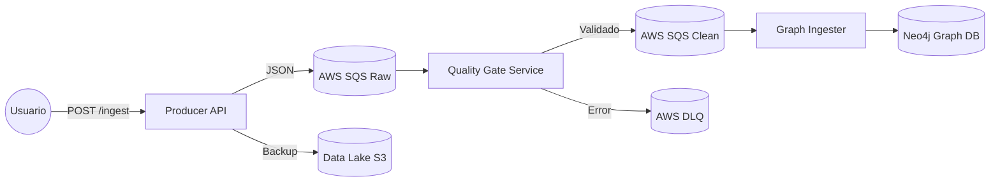

# Sistema de Recomendación de Películas Cloud-Native

Este proyecto es un Trabajo de Fin de Asignatura que implementa una **Arquitectura Empresarial Event-Driven** para la ingesta, validación, almacenamiento y recomendación de películas en tiempo real. Utiliza servicios de computación en la nube (**AWS**), bases de datos orientadas a grafos (**Neo4j**) y patrones de diseño robustos como **Quality Gates**.

---

## Arquitectura del Sistema

El flujo de datos sigue un diseño desacoplado de productores y consumidores:

1.  **Ingesta (Producer API):** Endpoint REST (Flask) que recibe calificaciones de usuarios. Actúa como *Broker* enviando eventos a AWS SQS y respaldos al Data Lake (S3).
2.  **Validación (Quality Gate Service):** Microservicio que consume la cola `RAW`, valida la integridad de los datos (Schema Validation) y expone métricas a **Prometheus**.
3.  **Persistencia (Graph Ingester):** Consume datos validados de la cola `CLEAN` y modela las relaciones (`Usuario -> VIO -> Pelicula`) en **Neo4j**.
4.  **Recomendación (Engine):** Algoritmo de filtrado colaborativo basado en grafos para sugerir contenido.

### Diagrama de Flujo

### Estrutura del proyecto

movie-recommender/
├── infrastructure/      # Scripts de IaC (Infraestructura como Código)
│   └── setup_aws.py     # Despliegue automático de colas SQS y Tópicos
├── src/
│   ├── common/          # Esquemas de datos compartidos (Pydantic)
│   ├── producer/        # API Flask (Simulador de tráfico)
│   ├── quality_gate/    # Servicio de validación y métricas
│   ├── graph_ingestion/ # Servicio de escritura en Neo4j (y Loader inicial)
│   └── recommender/     # Motor de recomendación (Query Engine)
├── tests/               # Pruebas automatizadas
│   ├── integration/     # Tests de Pytest
│   └── performance/     # Tests de carga con Locust
├── docker-compose.yml   # Orquestación local (Neo4j)
└── requirements.txt     # Dependencias

### Instalación y Despliege

1. Pre-requisitos
  Python 3.9 o superior.
  Docker y Docker Compose.
  Cuenta de AWS.

2. Configuración de Entorno
  Clona el repositorio e instala las dependencias:
    git clone <url-del-repo>
    cd movie-recommender
    pip install -r requirements.txt
  Configura tus credenciales de AWS en ~/.aws/credentials o exportando las variables de entorno.

3. Levantar Infraestructura (IaC)
  Ejecuta el script para crear las colas SQS y generar el archivo .env automáticamente:
    python infrastructure/setup_aws.py
